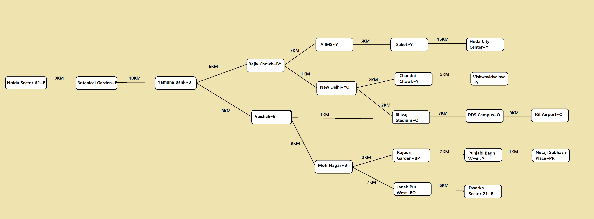

This is a simple python program that will take information (name) of the source station and the destination station, of Delhi Metro, from the user and display the shortest metro and all the shortest path to reach the destination. It will also be having a metro map for commuter’s better navigation.

The idea is implemented using Graph and Heap data structures. The graph has nodes and edges. Nodes represent a metro station that will be containing certain information regarding that station like its name, its serial number, and the lines which it connects. Edges (the connection between two nodes) represent the distance between the two stations and the cost of each edge will be equal to the distance between the two of its connecting stations(nodes).

By using different algorithms like Dijkstra, breadth-first search, depth-first search, etc, the shortest path between the source station and the destination station is determined, and accordingly, the fare is being calculated on the basis of the total distance between the two stations. Finally, the metro route between the two stations and the total fare is displayed.

